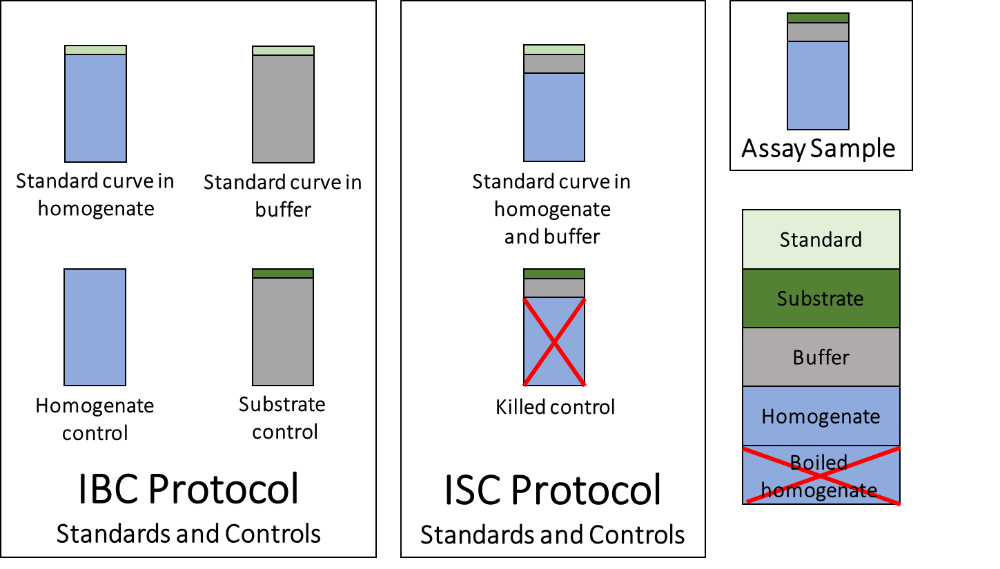

---
title: '*ezmmek* tutorial'
output:
  html_document:
  df_print: paged
  pdf_document: default
  rmarkdown::html_vignette: default
  word_document: default
vignette: >
%\VignetteIndexEntry{ezmmek_vignette} 
  %\VignetteEncoding{UTF-8}
  %\VignetteEngine{knitr::rmarkdown} 
  ---
  
  ```{r, include = FALSE}
knitr::opts_chunk$set(
collapse = TRUE,
comment = "#>"
)
library(ezmmek)
library(tibble)
```

## 1 Introduction

Extracellular enzymes produced by microorganisms play an important role in driving ecosystem processes and biogeochemical cycles. Extracellular enzyme assays were developed as methods to quantify enzymatic activity and further probe the interactions between microbes and organic matter. Fluorometric assays, which involve the detection of a fluorophore enzymatically cleaved from a substrate, are particularly popular due to their inexpensiveness, efficiency, and accessability. The fluorescence of a sample ideally increases with respect to time, and can be convereted to fluorophore production as a result of enzymatic hydrolysis. Although fluorometric assays are relatively simple in practice, several parameters can hinder the ability to measure activity values accurately. These parameters include 1) Adsorption of the fluorophore to solid surfaces, 2) Quenching of the fluorophore by dissolved compounds, 3) Abiotic release of the fluorophore from the substrate, and 4) Pre-existing background fluorescence (German et al., 2011)

As an important step in describing a standardized approach to fluorometric enzyme assays, German et al. (2011) synthesizes how to best correct for fluorometric interference by describing a protocol, complete with calculations and guidelines to address the effects of pH and temperature. However, the protocol described by German et al. (2011) has not been universally accepted among fluorometric assay practitioners. Other approaches differ in regard to how quenching is corrected and activity is calculated. As a reliable platform to compare and run different protocols, *ezmmek* aims to stimulate further discussion about how to best optimize extracellular enzyme assays.

\

### 1.1 In-Buffer Calibration protocol:
The protocol outlined by German et al. (2011), which will be referred to as the "In-Buffer Calibration (IBC)" protocol, corrects for quenching by measuring the interference from each individual component involved in an assay. The IBC protocol involves standard curves in the separate presence of homogenate (slurry of soil and buffer) and buffer. Also involved are the homogenate controls (i.e., sample slurry without added substrate), and substrate controls (i.e., substrate in the presence of buffer without sample slurry). The seperate standard curves correct for quenching of the fluorophore in two different solutions, which can affect later activity measurements. The homogenate and substrate controls correct for background fluorescence and abiotic degradation of the substrate, respectively. The IBC protocol measures activity based on one timepoint, which relies on the assumption that fluorescence in the sample at time zero is equal to the fluorescence of the homogenate control, corrected for quenching by the quench coefficient, minus the fluorescence of the substrate control. The equations to calculate activity are as follows:

$$\scriptsize (1)~Enzymatic~Activity~(mol~kg⁻¹~s⁻¹)~=~\frac{Net~Fluorescence~(fsu)~*~Buffer~Volume~(L)}{Emission~Coefficient~*~ Homogenate~Volume~(L)~*~Time~(s)~*~Soil~Mass~(kg)}$$
\
$$\scriptsize (2)~Net~Fluorescence~(fsu)~=~\frac{Assay~(fsu)~-~Homogenate~Control~(fsu)}{Quench~Coefficient}~-~Substrate~Control~(fsu)$$
\
$$\scriptsize (3)~Emission~Coefficient~(fsu~mol⁻¹)~=~\frac{Standard~Curve~Slope~[in~presence~of~homogenate]~(\frac{fsu}{\frac{mol}{L}})}{Assay~Volume~(L)}$$
\
$$\scriptsize (4)~Quench~Coefficient~=~\frac{Slope~of~Standard~Curve~[in~presence~of~homogenate]~(\frac{fsu}{\frac{mol}{L}})}{Slope~of~Standard~Curve~[in~presence~of~buffer]~(\frac{fsu}{\frac{mol}{L}})}$$
\
As written, the IBC protocol only applies to samples with a solid component, such as soil or sediment. To adjust this protocol for water samples, we replaced the soil mass from Equation 1 with the homogenate volume. When a solid is not present, the homogenate can simply be defined as the water sample in its entirety.

$$\scriptsize (5)~Enzymatic~Activity~(mol~L⁻¹~s⁻¹)~=~\frac{Net~Fluorescence~(fsu)~*~Buffer~Volume~(L)}{Emission~Coefficient~*~ Homogenate~Volume~(L)~*~Time~(s)~*~Homogenate~Volume~(L)}$$

*Equations 1 through 5 were edited from German et al. (2011) to reflect the International System (SI) of Units.

### 1.2 In-Sample Calibration protocol:
Unlike the IBC protocol, early environmental extracellular enzyme assays simply measured the change in fluorescence per unit time of a live sample versus that same rate of change of an autoclaved or killed sample (Hoppe, 1983), with a calibration curve measured using fluorophore added to the sample. This protocol will be referred to as the "In-Sample Calibration (ISC)" protocol. In contrast to the widespread use of the IBC Protocol within the soil microbial ecology community (DeForest, 2009; Allison et al., 2009; Stone et al., 2012), the ISC protocol has been widely used in within the aquatic microbial ecology community. The ISC protocol corrects for quenching by measuring bulk interference, which relies on the assumption that the behavior of the free fluorophore released from substrates behaves identically to the free fluorophore added to the sample to construct a calibration curve. The ISC protocol uses a standard curve in the presence of homogenate-buffer solution and killed controls, which comprise of substrate in the presence of autoclaved or boiled homogenate-buffer solution. Activity is calcluated as the slope of concentation of fluorphore with respect to time (*m* in Equations 7 and 9), which requires a minimum of two timepoints.

$$\scriptsize (6)~Enzymatic~Activity~(mol~kg⁻¹~s⁻¹)~=~Sample~Activity~(mol~kg⁻¹~s⁻¹)~-~Killed~Control~Activity~(mol~kg⁻¹~s⁻¹)$$
\
Activity for either the sample or the killed control is calculated as: 

$$\scriptsize (7)~Activity~(mol~kg⁻¹~s⁻¹)~=~\frac{m~(mol~L⁻¹~s⁻¹)}{Soil~Mass~(kg)}~*~Assay~V olume~(L)$$
\
$$\scriptsize (8)~Concentration~of~Fluorophore~(mol~L⁻¹)~=~\frac{Fluorescence~(fsu)~-~Intercept~of~Standard~Curve~[in~presence~of~homogenate]}{Slope~of~Standard~Curve~[in~presence~of~homogenate]}$$

For a liquid sample or killed control, Equation 7 can be simplified as follows:

$$\scriptsize (9)~Activity~(mol~L⁻¹~s⁻¹)~=~m~(mol~L⁻¹~s⁻¹)$$
Figure 1 shows the standards and controls , depicted as cuvette solutions. Although each protocol uses unique standards and controls, the assay sample from which raw fluorescence data is measured remains the same.

```{r, echo = FALSE, out.width = "60%", fig.cap = "Figure 1: Standards and controls of each protocol."}

```

## 2 Installation
The latest versions of *ezmmek* are available through CRAN and GitHub.

### 2.1 CRAN
```{r, eval = FALSE}
install.packages("ezmmek")
```

### 2.2 GitHub
#### 2.2.1 Install and load *devtools*
```{r, eval = FALSE}
install.packages("devtools")
library(devtools)
```
#### 2.2.2 Install *ezmmek*
```{r, eval = FALSE}
install_github("ccook/ezmmek")
```
#### 2.2.3 Required packages
```{r, eval = FALSE}
assertable
dplyr
magrittr
nls2
purrr
rlang
tidyr
```
## 3 How to use
### 3.1 Load *ezmmek*
```{r, eval = FALSE}
library(ezmmek)
```
### 3.2 Example datasets
Both protocols were applied to the same freshwater sample, which was collected from Third Creek in Tyson Park, Knoxville, TN 37919. The standard curve csv file contains data for both protocols. The raw activity csv files are split by protocol. In these example datasets, all column names but 'site.name' and 'std.type' are required for *ezmmek* to function properly. Although the exact names of 'site_name' and 'std_type' are not required, the user must input at least one descriptor column that is present in both the standard curve dataset and the raw activity dataset for any functions that rely on both datasets. The units are identified in the example datasets below, but units can be of any variety, and the user is responsible for keeping track of units throughout the analyses.

#### 3.2.1 Standard curve data
```{r, eval = FALSE}
std_data <- read.csv("inst/extdata/tyson_std_04172020.csv")
tibble::glimpse(std_data)
```

```{r, eval = FALSE}
site_name: Descriptor column (Tyson Park, Knoxville, TN)
std_type: Descriptor column (7-Amino-4-methylcoumarin; AMC)
std_conc: Standard concentration ([micro]M)
homo_signal: Signal from standard in homogenate (fsu)
buffer_signal: Signal from standard in buffer (fsu)
```
#### 3.2.2 Raw fluorescence data, IBC protocol
```{r}
raw_fsu_data_ibc <- read.csv(
  system.file("extdata", 
              "tyson_sat_german_04172020.csv", 
              package = "ezmmek"))
tibble::glimpse(raw_fsu_data_ibc)
```

```{r, eval = FALSE}
site_name: Descriptor column (Tyson Park, Knoxville, TN)
std_type: Descriptor column (7-Amino-4-methylcourmarin; AMC)
time: Timepoints at which signal was collected (hours)
signal: Signal from assay (fsu)
substrate_conc: Substrate concentration, ([micro]M)
replicate: Sample replicate (integer)
homo_vol: Homogenate volume (L)
soil_mass: Soil mass, or homogenate volume for a water sample (L) 
std_vol: Standard volume (L)
homo_control: Homogenate control (fsu)
substrate_control: Substrate control (fsu)
```
#### 3.2.3 Raw fluorescence data, ISC protocol
```{r, eval = FALSE}
raw_fsu_data_isc <- read.csv("data/tyson_sat_steen_04172020.csv")
tibble::glimpse(raw_fsu_data_isc)
```

```{r, eval = FALSE}
site_name: Descriptor column (Tyson Park, Knoxville, TN)
std_type: Descriptor column (7-Amino-4-methylcourmarin; AMC)
time: Timepoints at which signal was collected (hours)
signal: Signal from assay (fsu)
substrate_conc: Substrate concentration ([micro]Molar)
replicate: Sample replicate (integer)
kill_control: Signal from autoclaved sample (fsu)
```
### 3.3 Visible functions
*ezmmek* contains several functions that create new data.frame objects. The functions build upon each other. The user can choose how much analyses to perform, from generating standard curve models to calculating km and vmax values. In descending order of parent functions to child functions:
```{r, eval = FALSE}
new_ezmmek_sat_fit
new_ezmmek_act_calibrate
new_ezmmek_act_group
new_ezmmek_std_group
```
#### 3.3.1 Create data.frame object of class *new_ezmmek_sat_fit*
```{r, eval = FALSE}
new_obj <- new_ezmmek_sat_fit(std.data.fn,
                              act.data.fn,
                              ...,
                              km = NULL,
                              vmax = NULL,
                              method = NA)
```

```{r, eval = FALSE}
std.data.fn: Standard curve data file as character string
act.data.fn: Raw activity data file as character string
...: User defined column names to join and group std.data.fn and act.data.fn
km: Starting value to estimate km. Default value is median of 'sub.conc' values
vmax: Starting value to estimate vmax. Default value is max calibrated activity
method: Enzyme assay protocol. Must define method as '"ibc"' or '"isc"'
```
'"std.data.fn"' is the name of the standard curve data file. '"act.data.fn"' is the name of the raw activity data file. '...' are the user-defined column names by which the standard curve and raw activity data files are grouped and joined (*i.e.* descriptor columns like site name and type of fluorophore) to create a new data.frame. The default numeric starting values of 'km' and 'vmax' are those predicted by  *ezmmek*. 'km' is calculated as the median substrate concentration used during the experiment. 'vmax' is calculated as the maximum calibrated activity value. The user can assign their own 'km' and 'vmax' starting values if they so choose. 'method' must be set equal to '"ibc"' or '"isc"'. The resulting dataframe contains the descriptor columns, standard curve data, raw activity data, calibrated activity data, and Michaelis-Menten fits.

#### 3.3.2 Create data.frame object of class *new_ezmmek_calibrate*
```{r, eval = FALSE}
new_obj <- new_ezmmek_act_calibrate(std.data.fn,
                                    act.data.fn,
                                    ...,
                                    method = NA,
                                    columns = NULL)
```

```{r, eval = FALSE}
std.data.fn: Standard curve data file as character string
act.data.fn: Raw activity data file as character string
...: User defined column names to join and group std.data.fn and act.data.fn
method: Enzyme assay protocol. Must define method as '"ibc"' or '"isc"'
columns: User defined column names to join and group std.data.fn and act.data.fn
```
'columns' carries over any '...' arguments from parent functions. If the user does not run this function within a parent function, the 'columns' argument can be ignored and left on the 'NULL' default. '...' arguments must named if this function is used on its own. The resulting data.frame contains the calibrated activities, but not the Michaelis-Menten fits.

#### 3.3.3 Create data.frame object of class *new_ezmmek_act_group*
```{r, eval = FALSE}
new_obj <- new_ezmmek_act_group(act.data.fn,
                                ...,
                                method = NA,
                                columns = NULL)
```

```{r, eval = FALSE}
act.data.fn: Raw activity data file as character string
...: User defined column names to join and group std.data.fn and act.data.fn
method: Enzyme assay protocol. Must define method as '"ibc"' or '"isc"'
columns: User defined column names to join and group std.data.fn and act.data.fn
```
'columns' carries over any '...' arguments from parent functions. If the user does not run this function within a parent function, the 'columns' argument can be ignored and left on the 'NULL' default. '...' arguments must be named if this function is used on its own. The resulting data.frame contains grouped data of 'act.data.fn', as specified by column names.

#### 3.3.4 Create data.frame object of class *new_ezmmek_std_group*
```{r, eval = FALSE}
new_obj <- new_ezmmek_std_group(std.data.fn,
                                ...,
                                method = NA,
                                columns = NULL)
```

```{r, eval = FALSE}
std.data.fn: Standard curve data file as character string
...: User defined column names to join and group std.data.fn and act.data.fn
method: Enzyme assay protocol. Must define method as '"ibc"' or '"isc"'
columns: User defined column names to group std.data.fn
```
'columns' carries over any '...' arguments from parent functions. If the user does not run this function within a parent function, the 'columns' argument can be ignored and left on the 'NULL' default. '...' arguments must be named if this function is used on its own. The resulting data.frame contains grouped 'std.data.fn' data, as specified by column names, and standard curve linear models for each group.

## 4 Example analyses
### 4.1 *new_ezmmek_sat_fit*
#### 4.1.1 *new_ezmmek_sat_fit*, IBC
```{r, eval = FALSE}
sat_fit_ibc <- new_ezmmek_sat_fit("inst/extdata/tyson_std_04172020.csv", 
                                  "inst/extdata/tyson_sat_german_04172020.csv", 
                                  site_name, 
                                  std_type,
                                  km = NULL,
                                  vmax = NULL,
                                  method = "ibc")

tibble::glimpse(sat_fit_ibc)
```
#### 4.1.2 *new_ezmmek_sat_fit*, ISC
```{r, eval = FALSE}
sat_fit_isc <- new_ezmmek_sat_fit("inst/extdata/tyson_std_04172020.csv",
                                  "inst/extdata/tyson_sat_steen_04172020.csv", 
                                  site_name, 
                                  std_type,
                                  km = NULL,
                                  vmax = NULL,
                                  method = "isc")

tibble::glimpse(sat_fit_isc)
```
### 4.2 *new_ezmmek_act_calibrate*
#### 4.2.1 *new_ezmmek_act_calibrate*, IBC
```{r eval = FALSE}
act_calibrate_ibc <- new_ezmmek_act_calibrate("inst/extdata/tyson_std_04172020.csv",
                                              "inst/extdata/tyson_sat_german_04172020.csv",
                                              site_name,
                                              std_type,
                                              method = "ibc",
                                              columns = NULL)

tibble::glimpse(act_calibrate_ibc)
```
#### 4.2.2 *new_ezmmek_act_calibrate*, ISC
```{r, eval = FALSE}
act_calibrate_isc <- new_ezmmek_act_calibrate("inst/extdata/tyson_std_04172020.csv",
                                              "inst/extdata/tyson_sat_steen_04172020.csv",
                                              site_name,
                                              std_type,
                                              method = "isc",
                                              columns = NULL)

tibble::glimpse(act_calibrate_isc)
```
### 4.3 *new_ezmmek_act_group*
#### 4.3.1 *new_ezmmek_act_group*, IBC
```{r, eval = FALSE}
act_group_ibc <- new_ezmmek_act_group("inst/extdata/tyson_sat_german_04172020.csv",
                                      site_name,
                                      std_type,
                                      method = "ibc",
                                      columns = NULL)

tibble::glimpse(act_group_ibc)
```
#### 4.3.2 *new_ezmmek_act_group*, ISC
```{r, eval = FALSE}
act_group_isc <- new_ezmmek_act_group("inst/extdata/tyson_sat_steen_04172020.csv",
                                      site_name,
                                      std_type,
                                      method = "isc",
                                      columns = NULL)

tibble::glimpse(act_group_isc)
```
### 4.4 *new_ezmmek_std_group*
#### 4.4.1 *new_ezmmek_std_group*, IBC
```{r, eval = FALSE}
std_group_ibc <- new_ezmmek_std_group("inst/extdata/tyson_std_04172020.csv",
                                      site_name,
                                      std_type,
                                      method = "ibc",
                                      columns = NULL)

tibble::glimpse(std_group_ibc)
```
#### 4.4.2 *new_ezmmek_std_group*, ISC
```{r, eval = FALSE}
std_group_isc <- new_ezmmek_std_group("inst/extdata/tyson_std_04172020.csv",
                                      site_name,
                                      std_type,
                                      method = "isc",
                                      columns = NULL)
tibble::glimpse(std_group_isc)
```
## 5 Methods for *new_ezmmek* objects
### 5.1 *plot*
*plot* methods were created for each *new_ezmmek* object. The user can choose how to facet their plots by adding those columns/variables as arguments.  Because each *new_ezmmek* object is built off another, the child functions can be applied to objects created by more parent functions. For example, one can plot a standard curve using *plot.new_ezmmek_std_group(sat_fit_ibc)*.  

#### 5.1.1 *new_ezmmek_sat_fit*, IBC and ISC
Plot overlay of saturation curve on activities
```{r, fig.width = 6, fig.asp = 0.618, fig.align = "center", warning = FALSE, eval = FALSE}
plot(sat_fit_isc, site_name, std_type, substrate_type)
```  

#### 5.1.2 *new_ezmmek_calibrate*, IBC and ISC  
Plot activities and their associated error
```{r, fig.width = 6, fig.asp = 0.618, fig.align = "center", warning = FALSE, eval = FALSE}
plot(act_calibrate_ibc, site_name, std_type, substrate_type)
plot(act_calibrate_isc, site_name, std_type, substrate_type)
```

#### 5.1.3 *new_ezmmek_act_group*, IBC and ISC
Plot raw activity data
```{r, fig.width = 6, fig.align = "center", eval = FALSE}
plot(act_group_ibc, site_name, std_type, substrate_type)
plot(act_group_isc, site_name, substrate_type, std_type, substrate_conc)
```

#### 5.1.4 *new_ezmmek_std_group*, IBC and ISC
Plot standard curve(s)
```{r, fig.width = 6, fig.asp = 0.618, fig.align = "center", eval = FALSE}
plot(std_group_ibc, site_name, std_type)
plot(std_group_isc, site_name, std_type)
```

## 6 References
German et al. (2011) <doi:10.1016/j.soilbio.2011.03.017>   
Sinsabaugh et al. (2014) <doi:10.1007/s10533-014-0030-y>  
Steen and Arnosti (2011) <doi:10.1016/j.marchem.2010.10.006>

## 7 Authors
Christopher L. Cook (ccook62@vols.utk.edu) and Andrew D. Steen

## 8 License
This project is licensed under AGPL-3.
